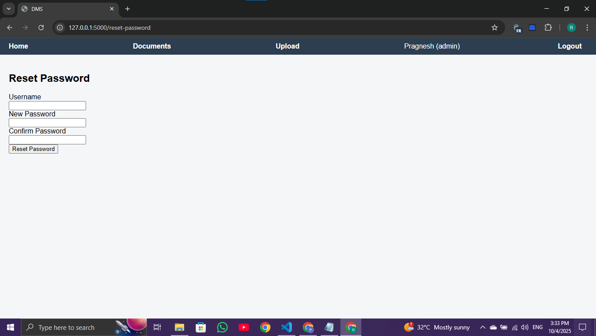

# DMS Project (Document Management System) 🚀

## Overview
DMS Project is a simple and fully functional Document Management System (DMS) where users can:
- Register  
- Login  
- Reset Password  
- Upload, Download, Edit, and Delete Documents  

It is built using **Flask** and **SQLAlchemy**, and is perfectly suitable for **internship-level projects**.

---

## Features ✨
- User Registration  
- User Login  
- Reset Password  
- Upload Document  
- Download Document  
- Edit Document  
- Delete Document  

---

## Technologies Used 🛠️
- **Backend:** Python, Flask, Flask-WTF, Flask-SQLAlchemy  
- **Frontend:** HTML, CSS  
- **Database:** SQLite  
- **Others:** Flask-Migrate for database migrations  

---

## Setup Instructions ⚡

1. **Install Python 3.13+**  
2. **Clone the repository:**  
```bash
git clone https://github.com/pragneshraval288-create/DMS-Project.git

Create virtual environment:

python -m venv venv


Activate virtual environment:

# Windows
venv\Scripts\activate

# Linux/Mac
source venv/bin/activate


Install required packages:

pip install -r requirements.txt


Apply database migrations:

flask db upgrade


Run the project:

flask run

Folder Structure 📂
backend/      # Flask backend code
frontend/     # HTML templates & CSS files
Database/     # SQLite database file
instance/     # Flask instance folder

How to Use 🎯

Open http://127.0.0.1:5000/
 in your browser

Register a user and log in

Upload and download documents

Edit or delete documents as needed

Screenshots Direct Links





